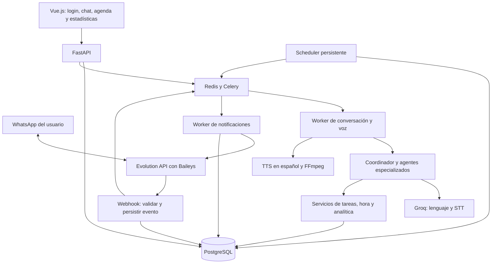

# Plan preliminar: asistente personal multiagente por web y WhatsApp

**Objetivo:** crear una aplicación con FastAPI y Vue.js que permita iniciar sesión, conversar por texto y notas de voz, organizar tareas y recibir recordatorios programados por WhatsApp en texto o audio.

**Arquitectura:** backend modular con agentes especializados que usan Groq y herramientas controladas por la aplicación. PostgreSQL conserva las tareas y la programación; procesos independientes gestionan los vencimientos, la voz y los envíos mediante Evolution API con Baileys.

**Stack propuesto:** FastAPI, Pydantic, SQLAlchemy, Alembic, PostgreSQL, Redis, Celery, Vue 3, TypeScript, Vite, Vue Router, Pinia, Groq, Evolution API, FFmpeg y un adaptador TTS en español.

**Estado:** diseño preliminar y hoja de ruta; no se ha implementado la aplicación. El directorio estaba vacío al preparar este documento. Las rutas y contratos siguientes son propuestas para el proyecto nuevo.

**Actualización de implementación:** primer incremento en desarrollo. Requisito añadido por el usuario: todos los servicios propios deben ser dockerizables y desplegables en Dokploy mediante Docker Compose.

**Guía de ejecución:** desarrollar por fases comprobables usando `superpowers:executing-plans`; convertir cada fase en tareas de implementación detalladas al iniciarla. Este documento reúne los requisitos y el diseño preliminar solicitado, sin pretender ser código listo para ejecutar.

## 1. Supuestos y alcance

- “Fast” se interpreta como FastAPI para Python.
- Idioma inicial: español. Zona horaria inicial: `America/Bogota`, configurable por usuario.
- Aplicación multiusuario desde el modelo de datos, aunque el primer piloto tenga un solo usuario.
- Un número dedicado al asistente estará conectado a Evolution API. Cada usuario vinculará su propio número como destinatario y remitente autorizado.
- Las API keys de Groq serán administradas en el servidor. No se requiere una clave diferente por agente. Incorporar claves personales por usuario será una ampliación opcional.
- Análisis de datos significa inicialmente medir tareas, cumplimiento, aplazamientos y uso del asistente. El análisis de archivos CSV/Excel se describe como una fase posterior.
- “Hablar por WhatsApp” significa enviar notas de voz reproducibles; no llamadas telefónicas ni reproducción forzada en el dispositivo.

### MVP

- Registro, login, logout, recuperación de acceso y perfil.
- Vinculación verificada del número de WhatsApp.
- Crear, consultar, modificar, completar, cancelar y aplazar tareas y recordatorios.
- Recordatorios únicos y recurrencias diarias/semanales.
- Chat web y WhatsApp con entrada de texto o audio en español.
- Respuestas por texto, audio o ambos, según preferencias.
- Avisos automáticos aunque el navegador esté cerrado.
- Panel básico de actividad e historial de entregas.

### Ampliaciones posteriores

- Análisis de CSV/Excel, calendarios externos y notificaciones push web.
- Recurrencias avanzadas, hábitos y resúmenes proactivos configurables.
- Instancia de WhatsApp por usuario, organizaciones y claves personales.
- Aplicaciones móviles nativas y conversaciones de voz en tiempo real.

## 2. Opciones de arquitectura

| Alternativa | Ventajas | Costes o limitaciones |
| --- | --- | --- |
| Backend modular + workers independientes, recomendada | Una base de código; responsabilidades claras; recordatorios persistentes | Requiere operar base de datos, cola y workers |
| Microservicio por agente | Despliegue y escalado individual | Añade coordinación y operación prematuras para el MVP |
| Plataforma de automatización como núcleo | Facilita una prueba rápida de integraciones | El aislamiento de usuarios y la lógica temporal quedarían repartidos entre flujos |

Empezar con la primera opción. Los agentes serán módulos especializados, no servidores separados. La programación de recordatorios será lógica determinista del backend.

## 3. Arquitectura propuesta



El servidor debe permanecer encendido y sincronizar su reloj. No usar temporizadores del navegador ni tareas en memoria de FastAPI como fuente de verdad para los avisos.

## 4. Agentes y herramientas

| Componente | Responsabilidad | Herramientas permitidas |
| --- | --- | --- |
| Coordinador | Entender la intención, resolver contexto y delegar | Consultar hora y llamar al especialista apropiado |
| Agente de tareas | Gestionar pendientes, prioridades y estados | Crear, listar, editar y completar tareas |
| Agente de recordatorios | Interpretar fecha, recurrencia y aplazamientos | Consultar hora, crear, modificar y cancelar recordatorios |
| Agente de análisis | Explicar estadísticas y sugerir ajustes | Consultas agregadas autorizadas de solo lectura |

STT, TTS y envío de mensajes serán servicios técnicos; no necesitan agentes adicionales. El coordinador solo activará los especialistas necesarios para cada solicitud.

Contratos conceptuales internos:

- `get_current_time(context) -> {utc_now, local_now, timezone}`.
- `create_task(context, title, priority) -> Task`.
- `list_tasks(context, filters) -> list[Task]`.
- `update_task(context, task_id, changes) -> Task`.
- `complete_task(context, task_id) -> Task`.
- `create_reminder(context, task_id, local_datetime, timezone, recurrence, channel) -> Reminder`.
- `update_reminder(context, reminder_id, changes) -> Reminder`.
- `snooze_reminder(context, reminder_id, minutes) -> Reminder`.
- `cancel_reminder(context, reminder_id) -> Reminder`.
- `get_productivity_summary(context, start, end) -> ProductivitySummary`.

`context` contiene la identidad autenticada y el identificador de solicitud; el servidor lo construye, nunca lo decide el modelo. Validar argumentos con Pydantic y verificar propiedad de cada recurso. No proporcionar SQL arbitrario, shell ni acceso libre a secretos.

Limitar cada turno inicialmente a seis llamadas a herramientas y un tiempo máximo configurable. Guardar acciones y resultados; solo afirmar “recordatorio creado” después de confirmar la transacción. Para borrar en bloque o cambiar múltiples recordatorios, mostrar un resumen y solicitar confirmación al usuario.

Groq permite integrar llamadas a herramientas que ejecuta la aplicación: [documentación de tool use](https://console.groq.com/docs/tool-use/overview). El modelo de lenguaje se elegirá mediante `GROQ_CHAT_MODEL`, verificando disponibilidad y comportamiento en español antes de fijar la versión de despliegue.

## 5. Flujo de voz y conversación

1. El usuario envía texto o una nota de voz por WhatsApp o desde la web.
2. El backend valida sesión o webhook, resuelve al usuario y persiste un evento único.
3. El worker recupera el audio mediante el adaptador de Evolution, valida tamaño y tipo real y lo convierte si es necesario.
4. Groq transcribe mediante `audio/transcriptions`, con idioma español. Propuesta inicial: `whisper-large-v3-turbo`, configurable. Se usa transcripción, no traducción al inglés. Véase [STT de Groq](https://console.groq.com/docs/speech-to-text).
5. El coordinador interpreta la solicitud y llama a las herramientas necesarias.
6. Si falta fecha, hay varios referentes o el audio resulta incomprensible, solicita aclaración antes de crear el aviso.
7. El servidor persiste el cambio y devuelve una confirmación con fecha, hora y zona horaria.
8. Si corresponde audio, el proveedor TTS genera voz en español y FFmpeg prepara el formato aceptado por la versión instalada de Evolution; probar OGG/Opus como nota de voz.
9. Se envía por WhatsApp y se registra su estado. Si falla la voz, se envía el texto de respaldo.

Ejemplo: “Mañana a las ocho de la mañana recuérdame entregar el informe”. La respuesta debe incluir la fecha absoluta calculada y `08:00, America/Bogota`. “A las ocho” sin contexto suficiente requiere aclarar mañana/noche.

### TTS en español: dependencia importante

La documentación consultada de Groq enumera TTS en inglés y árabe, no español: [TTS de Groq](https://console.groq.com/docs/text-to-speech). No asumir que una API key de Groq cubre la voz de salida en español.

Propuesta: conservar Groq para lenguaje y STT, y usar Azure Speech para TTS en español mediante un adaptador intercambiable. Su catálogo documenta voces en español: [idiomas y voces de Azure Speech](https://learn.microsoft.com/en-us/azure/ai-services/speech-service/language-support?tabs=tts). Esto requiere credenciales y presupuesto adicionales. Si se requiere operar exclusivamente con Groq como servicio externo, evaluar un motor TTS local en español y medir calidad y consumo antes de elegirlo.

Límites iniciales propios: cinco minutos y 20 MB por audio. Rechazar archivos que excedan cualquiera, aplicar timeout de conversión y borrar temporales incluso en errores. Los límites efectivos del proveedor deben comprobarse al desplegar.

## 6. WhatsApp: Evolution API y Baileys

Evolution API será la pasarela y Baileys su modo de conexión con WhatsApp. Evitar desplegar una segunda integración directa con Baileys en paralelo. Referencia del proyecto: [Evolution API](https://github.com/evolution-foundation/evolution-api).

### Conexión y asociación de usuarios

1. El administrador crea una instancia del bot y vincula su cuenta de WhatsApp mediante el mecanismo de emparejamiento de la versión instalada, normalmente QR.
2. El usuario inicia sesión en Vue e introduce su número con indicativo internacional.
3. La web genera un código de vinculación de un solo uso, con caducidad de diez minutos.
4. El usuario envía ese código desde su WhatsApp al número del asistente.
5. El backend asocia el remitente verificado con el usuario y comprueba que coincide con el número declarado. Aplicar límite de intentos y unicidad del número activo.
6. El usuario activa los avisos y selecciona texto, audio o ambos. Desvincular el teléfono revoca inmediatamente el permiso de envío.

Escribir un número no autentica al usuario ni conecta la cuenta emisora. Si Evolution utiliza identificadores alternativos al número, resolverlos con los datos de la instancia y conservar el mapeo verificado; no inferir identidad cortando cadenas.

### Contrato del adaptador

- `send_text(recipient, text) -> provider_message_id`.
- `send_voice(recipient, media_reference) -> provider_message_id`.
- `fetch_media(message_reference) -> validated_audio`.
- Normalizar mensajes entrantes, cambios de conexión y estados de entrega.

Fijar una versión de Evolution y verificar sus endpoints, payloads y mecanismo de autenticación antes de implementar: las rutas de documentación varían entre versiones. Persistir sesiones y bases de datos necesarias para no perder el emparejamiento al reiniciar.

Procesar mensajes directos de usuarios verificados. Ignorar grupos, estados, mensajes propios y ecos salientes para evitar bucles. Deduplicar por instancia e identificador de mensaje. Responder al webhook rápidamente después de persistirlo; la transcripción ocurre en el worker.

Validar autenticidad con el mecanismo disponible en la versión seleccionada. Si no hay firma verificable, exigir un secreto de webhook validado en gateway/backend y restringir el acceso desde la infraestructura de Evolution. No tratar el número declarado dentro de un JSON sin autenticar como identidad suficiente.

La modalidad Baileys depende de una sesión de WhatsApp y puede desconectarse; el piloto debe comprobar reconexión y compatibilidad. Mantener el adaptador para permitir evaluar otro transporte en el futuro.

## 7. Recordatorios y hora

### Persistencia y ejecución

- Guardar instantes en UTC y conservar zona IANA, hora local y regla de recurrencia originales.
- Interpretar “hoy” o “mañana” usando la hora del servidor convertida a la zona del usuario. Incluir fecha de recepción para no reinterpretar un mensaje retrasado como si acabara de llegar.
- Scheduler independiente con revisión cada 15 segundos. PostgreSQL es la fuente de verdad; Redis transporta trabajo recuperable.
- Reclamar vencimientos con bloqueo transaccional y crear una entrega en una tabla outbox. Clave única por recordatorio, ocurrencia, canal y tipo de contenido.
- Un publicador despacha la outbox a los workers. Volver a comprobar estado, versión y vinculación del teléfono antes del envío para respetar cancelaciones.
- Al reiniciar, recuperar pendientes. Política inicial: enviar avisos con hasta una hora de retraso indicando la hora original; marcar los más antiguos como omitidos y mostrarlos en el panel.
- Recurrencias calculadas en hora local para respetar cambios de horario estacional; rechazar horas inexistentes y pedir elección cuando una hora sea ambigua.
- No mantener una llamada al LLM abierta esperando la hora. Preparar el texto/voz cuando sea posible; un aviso ya programado debe poder salir aunque Groq esté caído.

### Entrega, errores y precisión

Estados separados: `pending`, `processing`, `accepted`, `delivered`, `read`, `failed`, `unknown`, `skipped`. Aceptado por Evolution no significa recibido ni leído en WhatsApp.

Reintentar fallos transitorios conocidos con esperas de 30 segundos, dos minutos y diez minutos, dentro de la ventana de una hora. Ante timeout con resultado incierto, marcar `unknown` y conciliar con eventos del proveedor antes de reenviar; no prometer entrega exactamente una vez si el transporte no ofrece idempotencia.

Objetivo del piloto: iniciar el envío en menos de 30 segundos desde el vencimiento bajo carga normal. La llegada al teléfono depende del proveedor y de la conectividad; medirla por separado.

Preferencias: canal, formato de respuesta y horario de silencio. Si un aviso cae en silencio, informar al programarlo y mover la entrega al final del periodo, salvo que el usuario marque explícitamente ese recordatorio como permitido durante silencio.

## 8. Login, seguridad y datos personales

- Registro con email y contraseña; verificar email para activar la cuenta. Recuperación por token de un solo uso con caducidad; requiere proveedor SMTP/transaccional.
- Hash de contraseñas con Argon2id. Sesiones opacas revocables almacenadas mediante hash en PostgreSQL.
- Cookie `HttpOnly`, `Secure` y `SameSite=Lax` en producción; protección CSRF para cambios y comprobación de origen. Servir web y API bajo el mismo dominio.
- Rate limiting para login, registro, recuperación y vinculación. Recuperación con respuesta genérica para no revelar cuentas.
- Todas las entidades personales incluyen `user_id`; derivarlo de la sesión o vinculación verificada. Comprobarlo también en workers, descargas y consultas analíticas.
- API keys únicamente en secretos del servidor. Si se incorporan claves por usuario, cifrarlas con una clave de servidor separada y nunca devolverlas completas.
- HTTPS, almacenamiento privado de audios, URLs firmadas breves y logs sin claves ni contenido sensible.
- Validar multimedia; permitir descargas solo desde orígenes controlados para evitar SSRF. Ejecutar conversiones con recursos y tiempo limitados.
- Tratar conversaciones, transcripciones y archivos como datos no confiables. Las instrucciones dentro de ellos no pueden ampliar permisos ni desactivar controles.
- Retención propuesta: audio original 24 horas, transcripciones 30 días, historial de tareas hasta eliminación por el usuario. Explicar estos plazos en configuración e implementar limpieza y borrado/exportación de cuenta.
- Registrar quién ejecutó cada acción, fecha, canal y recurso afectado. Separar los accesos administrativos de las consultas personales.

## 9. Modelo de datos inicial

| Entidad | Campos principales |
| --- | --- |
| `users` | id, email, password_hash, email_verified_at, timezone, locale |
| `sessions` | id, user_id, token_hash, expires_at, revoked_at |
| `auth_tokens` | user_id, purpose, token_hash, expires_at, consumed_at |
| `user_preferences` | user_id, response_mode, quiet_hours, notification_enabled |
| `whatsapp_links` | user_id, phone_e164, provider_sender_id, instance_id, verified_at, revoked_at |
| `link_challenges` | user_id, expected_phone, code_hash, expires_at, attempts, consumed_at |
| `tasks` | id, user_id, title, description, priority, status, created_at, completed_at |
| `reminders` | id, user_id, task_id, timezone, local_time, recurrence, next_run_at, status, version |
| `reminder_occurrences` | id, reminder_id, scheduled_at, status; unique(reminder_id, scheduled_at) |
| `notification_deliveries` | occurrence_id, channel, content_type, status, attempts, provider_message_id, accepted_at, delivered_at |
| `outbox_events` | id, delivery_id, payload_reference, published_at, locked_until |
| `inbound_events` | instance_id, provider_event_id, payload_reference, received_at, processed_at |
| `conversations` / `messages` | user_id, channel, direction, content, media_id, provider_message_id, created_at |
| `media_assets` | user_id, private_storage_key, mime_type, duration, expires_at |
| `agent_runs` | user_id, model, tool_names, status, latency_ms, token_usage, created_at |
| `task_events` | user_id, task_id, event_type, occurred_at, previous_status, new_status |

Separar tareas de recordatorios: una tarea puede tener varios avisos. Añadir índices por usuario/estado y recordatorio/fecha; claves foráneas y restricciones para impedir que un recordatorio apunte a una tarea de otro usuario.

## 10. API propia propuesta

Todas las rutas llevan prefijo `/api/v1`. Excepto autenticación y webhook, requieren sesión; webhook utiliza su autenticación de integración.

| Método y ruta | Función |
| --- | --- |
| `POST /auth/register`, `/auth/login`, `/auth/logout` | Gestión de acceso |
| `POST /auth/verify-email`, `/auth/forgot-password`, `/auth/reset-password` | Verificación y recuperación |
| `GET /auth/me` | Usuario autenticado |
| `GET/PATCH /me/preferences` | Zona horaria, voz y avisos |
| `GET/POST /tasks` | Consultar o crear tareas |
| `PATCH /tasks/{id}` | Editar, completar o cancelar |
| `GET/POST /reminders` | Consultar o programar |
| `PATCH /reminders/{id}` | Reprogramar o cancelar |
| `POST /reminders/{id}/snooze` | Aplazar una ocurrencia |
| `POST /chat/messages`, `/chat/audio` | Aceptar mensaje o audio; devolver id y estado de procesamiento |
| `GET /chat/messages` | Historial paginado y estado de respuestas |
| `POST /whatsapp/link` | Generar desafío de vinculación |
| `GET /whatsapp/status`, `DELETE /whatsapp/link` | Estado y desvinculación |
| `POST /integrations/evolution/webhook` | Recibir eventos autenticados |
| `GET /analytics/summary`, `/analytics/daily` | Datos agregados del usuario |
| `GET /notifications` | Historial y problemas de entrega |

Errores consistentes con código, detalle legible y `request_id`. Listados paginados; escrituras conversacionales deduplicadas por identificador de solicitud. La documentación OpenAPI del backend será el contrato que consume Vue.

## 11. Frontend Vue.js

Diseño funcional preliminar, pensado primero para móvil:

- **Acceso:** login, registro, verificación y recuperación.
- **Inicio:** tareas de hoy, próximo recordatorio, botón de nueva tarea y estado del canal WhatsApp.
- **Asistente:** chat, grabación con permiso del micrófono, vista previa, transcripción y reproductor de audio. Mostrar cuándo una acción necesita aclaración.
- **Agenda:** lista por día, filtros y edición de fecha, recurrencia y estado.
- **Actividad:** métricas por periodo y gráficos acompañados de una tabla accesible.
- **Configuración:** zona horaria, vinculación del teléfono, respuesta de texto/audio, horarios de silencio y eliminación de datos.

Gestionar carga, errores, listas vacías y sesión expirada. Las guardas de Vue mejoran navegación; la autorización siempre se aplica en FastAPI. El navegador puede exigir una interacción para reproducir audio y no garantiza hablar con la pestaña cerrada; WhatsApp cubre los avisos del MVP.

## 12. Análisis de datos

### Primera etapa: productividad personal

Registrar eventos de creación, finalización, cancelación, aplazamiento y entrega desde el inicio. Obtener métricas con consultas SQL parametrizadas, restringidas al usuario y al periodo en su zona horaria.

Indicadores con definición explícita:

- Tareas creadas y completadas durante el periodo, como conteos separados.
- Cumplimiento de cohorte: tareas creadas en el periodo y completadas hasta el corte / tareas creadas en el periodo. Si no hay tareas, mostrar “sin datos”.
- Número de aplazamientos por tarea y categorías de mayor actividad.
- Tiempo entre creación y finalización de tareas completadas, mostrando tamaño de muestra.
- Latencia de despacho: instante de aceptación del envío menos hora programada.
- Tasa de entrega confirmada: entregas con confirmación / entregas aceptadas, mostrando por separado los estados desconocidos.

Vue muestra gráficos y filtros diarios/semanales. El agente de análisis recibe los agregados y explica tendencias sin inventar cifras ni atribuir causas no medidas. Ejemplo: “Esta semana completaste 8 tareas y aplazaste 3 avisos”. Las recomendaciones son sugerencias y no modifican la agenda automáticamente.

### Segunda etapa: CSV/Excel

Agregar carga privada de archivos con límites de tamaño, filas y columnas; permitir CSV y XLSX sin ejecutar macros. Procesar mediante funciones de pandas predefinidas para perfiles, nulos, duplicados, agrupaciones y resúmenes. Ejecutar trabajos aislados con límites de memoria y tiempo.

El modelo selecciona operaciones permitidas; no ejecuta Python generado libremente. Guardar procedencia, filtros y fecha de cada resultado para reproducibilidad. Exportar tablas y gráficos y proteger las exportaciones CSV contra fórmulas interpretables por hojas de cálculo.

## 13. Estructura de proyecto propuesta

```text
backend/
  app/
    main.py
    core/                  # Configuración, sesiones y contexto de usuario
    db/                    # Conexión y registro de modelos
    auth/                  # Registro, login, tokens y recuperación
    users/                 # Preferencias y vinculación de identidad
    tasks/                 # Modelos, schemas, servicio y rutas de tareas
    reminders/             # Recurrencias, ocurrencias y programación
    conversations/         # Historial y procesamiento de turnos
    agents/                # Coordinador, especialistas y herramientas
    integrations/          # Clientes Groq, Evolution y TTS
    media/                 # Almacenamiento, validación y conversión
    notifications/         # Outbox, envíos y conciliación
    analytics/             # Eventos, consultas y resúmenes
    workers/               # Scheduler y tareas de Celery
  migrations/
  tests/
frontend/
  src/
    router/
    stores/
    services/              # Cliente HTTP y contratos de API
    views/                 # Acceso, inicio, chat, agenda, actividad y ajustes
    components/
  tests/
infra/
  compose.yaml
  proxy/
.env.example
plan.md
README.md
```

## 14. Hoja de ruta de implementación

Cada fase debe entregar un flujo utilizable. Las pruebas listadas son criterios para la implementación futura, no comprobaciones ya ejecutadas.

### Fase 0 — Validar integraciones

- [ ] Fijar versiones compatibles y documentar variables en `.env.example` sin secretos: `DATABASE_URL`, `REDIS_URL`, `GROQ_API_KEY`, `GROQ_CHAT_MODEL`, `GROQ_STT_MODEL`, `TTS_PROVIDER`, credenciales TTS, `EVOLUTION_BASE_URL`, `EVOLUTION_API_KEY`, `EVOLUTION_INSTANCE`, secreto webhook y configuración SMTP.
- [ ] Documentar en `docs/integrations.md` payloads reales, conexión, eventos y recuperación de multimedia de la versión elegida.
- [ ] Realizar pruebas con una cuenta y número de desarrollo: recibir audio español, transcribirlo y devolver una nota de voz española.
- [ ] Medir latencia, calidad y consumo; comprobar restricciones de formatos y límites reales.

**Salida:** evidencia de texto y voz de extremo a extremo y decisión concreta del proveedor TTS. No bloquear tareas y login si faltan credenciales de voz; sí mantener pendiente la validación del flujo completo.

### Fase 1 — Base, login y aislamiento

- [ ] Crear `infra/compose.yaml`, `backend/app/main.py`, configuración y migraciones; servir Vue y API mediante el proxy.
- [ ] Implementar `backend/app/auth/` y `users/`; crear vistas de acceso y configuración del perfil.
- [ ] Añadir pruebas en `backend/tests/test_auth.py` y `test_user_isolation.py`: login correcto, contraseña incorrecta, sesión revocada, token expirado, CSRF y acceso cruzado denegado.
- [ ] Verificar registro, recuperación y logout en un navegador con el correo de pruebas.

**Salida:** dos usuarios pueden acceder sin consultar datos ajenos.

### Fase 2 — Tareas y programación persistente

- [ ] Implementar `tasks/`, `reminders/`, `notifications/` y `workers/scheduler.py` con migraciones y restricciones únicas.
- [ ] Crear agenda y formularios de tareas/recordatorios en `frontend/src/views/`.
- [ ] Probar en `backend/tests/test_reminders.py` UTC, recurrencia, aplazamiento, cancelación, reinicio y dos workers reclamando el mismo vencimiento.
- [ ] Usar un adaptador de notificación falso para demostrar despacho sin depender de WhatsApp.

**Salida:** el aviso sobrevive a reinicios y una ocurrencia genera una sola entrega lógica por canal/formato.

### Fase 3 — WhatsApp de texto

- [ ] Implementar `integrations/evolution.py`, webhook, vinculación y trabajador de entrega.
- [ ] Añadir vista de vinculación y estados de conexión.
- [ ] Probar `backend/tests/test_whatsapp.py`: código expirado, remitente distinto, webhook duplicado, evento no autenticado, eco propio y timeout de envío.
- [ ] Enviar un recordatorio real al número de pruebas, con navegador cerrado, y registrar aceptación y entrega cuando el proveedor las informe.

**Salida:** vinculación verificada y avisos de texto por WhatsApp.

### Fase 4 — Conversación multiagente

- [ ] Implementar `agents/coordinator.py`, especialistas, schemas de herramientas y cliente Groq.
- [ ] Añadir chat e historial compartiendo servicios de dominio con la agenda.
- [ ] Crear pruebas en `backend/tests/test_agents.py` con respuestas simuladas del proveedor para acciones, fechas ambiguas, permisos, duplicados y límites del turno.
- [ ] Evaluar con un conjunto fijo de frases españolas: “mañana a las 8 a. m.”, “en 20 minutos”, “cada lunes a las 7 p. m.” y “aplázalo”, incluyendo conversación sin referente.

**Salida:** web y WhatsApp pueden crear, consultar, completar y aplazar mediante lenguaje natural con confirmaciones basadas en resultados reales.

### Fase 5 — Voz bidireccional

- [ ] Implementar `media/`, `integrations/stt.py`, `integrations/tts.py` y grabación/reproducción web.
- [ ] Probar `backend/tests/test_voice_pipeline.py`: formatos reales, archivo inválido, silencio, exceso de duración, fallo de STT y fallback de TTS a texto.
- [ ] Validar en WhatsApp móvil que la salida sea reproducible como nota de voz.
- [ ] Comprobar limpieza de temporales y expiración de audios almacenados.

**Salida:** una nota de voz crea un recordatorio y recibe confirmación y aviso en español según preferencias.

### Fase 6 — Analítica personal

- [ ] Implementar eventos y consultas en `analytics/`, vista de actividad y herramienta del agente analista.
- [ ] Probar en `backend/tests/test_analytics.py` un conjunto conocido de tareas con aplazamientos y fechas que cruzan medianoche local.
- [ ] Verificar denominadores, periodos vacíos y aislamiento; contrastar texto del agente con agregados del backend.

**Salida:** estadísticas reproducibles y resumen conversacional sin cifras inventadas.

### Fase 7 — Preparación de operación

- [ ] Configurar HTTPS, secretos, copias de seguridad, persistencia de Evolution y reinicio automático de servicios.
- [ ] Añadir alertas de desconexión, backlog de cola, avisos retrasados, errores de proveedores y agotamiento de presupuesto.
- [ ] Ejecutar pruebas E2E de Vue con Playwright y flujo real controlado de WhatsApp; comprobar caída de Redis, recuperación de outbox y restauración de base de datos.
- [ ] Documentar despliegue, reconexión, rotación de claves, restauración y borrado de datos en `README.md` y `docs/operations.md`.

**Salida:** piloto operativo con métricas y procedimiento de recuperación.

Comandos previstos una vez exista el proyecto: `cd backend && pytest`, `cd frontend && npm run build`, `cd frontend && npm run test:unit` y `cd frontend && npx playwright test`. Crear los scripts y dependencias correspondientes al implementar; hoy no existen.

## 15. Criterios de aceptación del MVP

- [ ] El login protege la API y un usuario no puede leer ni modificar recursos de otro.
- [ ] El usuario vincula su número mediante una prueba de posesión.
- [ ] Un texto y una nota de voz en español permiten crear el mismo recordatorio.
- [ ] La confirmación incluye fecha, hora, zona y resultado persistido.
- [ ] Los avisos funcionan con la web cerrada y sobreviven al reinicio del backend.
- [ ] Se puede completar, cancelar y aplazar por web y por WhatsApp.
- [ ] Una recurrencia produce la siguiente ocurrencia correcta en hora local.
- [ ] Los webhooks duplicados no crean tareas o recordatorios repetidos.
- [ ] Los envíos inciertos no se presentan como entregados ni se reintentan ciegamente.
- [ ] El usuario recibe voz española y texto de respaldo cuando falle TTS.
- [ ] El panel presenta cifras verificables y estados desconocidos explícitos.
- [ ] Ninguna API key aparece en el frontend, repositorio o logs.

## 16. Decisiones pendientes antes de implementar las fases dependientes

1. Confirmar si el análisis se limita a productividad o debe incluir CSV/Excel desde la primera entrega. Por defecto se deja CSV/Excel para después del MVP.
2. Elegir TTS en español: propuesta Azure Speech; alternativa motor local si se quiere evitar otra API comercial.
3. Disponer de un número dedicado al bot, credenciales Groq y hosting continuo con HTTPS.
4. Definir presupuesto mensual y cuotas por usuario para tokens, minutos STT, caracteres TTS, almacenamiento y mensajes.
5. Confirmar retención propuesta y preferencias iniciales de audio/silencio.

Estas decisiones no impiden usar este documento como diseño preliminar. El primer incremento recomendado es login, tareas y recordatorios persistentes, mientras se valida voz y WhatsApp con credenciales de desarrollo.

## 17. Docker y despliegue en Dokploy

Requisito obligatorio: entregar imágenes reproducibles para backend y frontend, y composición de servicios compatible con Dokploy.

- `backend/Dockerfile`: runtime Python, dependencias instaladas y proceso sin privilegios. La misma imagen ejecutará API o scheduler con comandos diferentes.
- `frontend/Dockerfile`: construcción de Vue en una etapa Node y servicio de archivos estáticos mediante Nginx en la imagen final.
- `infra/compose.yaml`: entorno local con PostgreSQL, API, scheduler y web. Añadir Redis/Celery y Evolution cuando esas integraciones estén implementadas.
- `infra/compose.dokploy.yaml`: despliegue sin publicar puertos de PostgreSQL/API al host; Dokploy enruta el dominio al servicio web. Nginx redirige `/api` al backend dentro de la red privada.
- Cookies seguras y verificación de correo obligatorias en producción; secretos suministrados desde las variables de entorno de Dokploy, sin incorporarlos a las imágenes ni al repositorio.
- Volúmenes nombrados para PostgreSQL y datos privados necesarios. Las próximas integraciones también persistirán sesiones de Evolution y multimedia según su política de retención.
- Healthchecks de API, web y base de datos; reinicio automático y arranque dependiente de servicios sanos.
- Migraciones ejecutadas de forma controlada antes de iniciar workers. Nunca reinicializar o borrar datos al actualizar una imagen.
- Documentar dominio, puerto interno, variables obligatorias, actualización, copia de seguridad y recuperación en `docs/dokploy.md`.
- Comprobar `docker compose config`, construir imágenes y realizar una prueba de login/tareas a través del proxy. El despliegue real requiere acceso al Dokploy del usuario y configuración de DNS.
